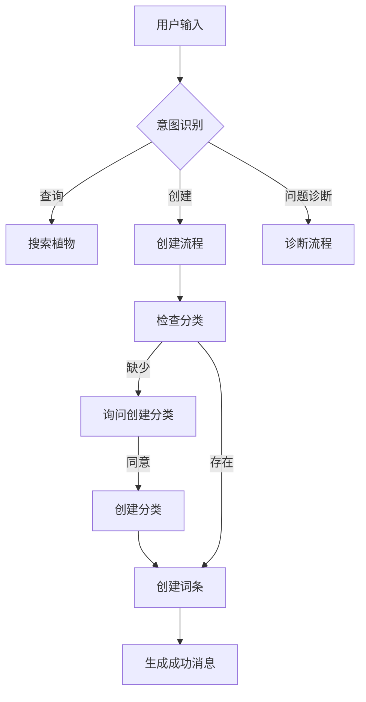

# FlowerKB AI Agent 完善计划

## 📋 项目背景

我们已经完成了 AI Agent 的概念验证（POC），实现了基本的对话功能：
- ✅ 植物搜索 (`searchPlant`)
- ✅ 获取养护详情 (`getPlantDetail`)
- ✅ 创建植物词条 (`createPlant`)
- ✅ 创建分类 (`createTaxonomy`)

本计划旨在全面完善 AI Agent，打造专业、可靠、用户友好的植物知识库助手。

---

## 🎯 完善目标

1. **提升用户体验** - 流畅自然的对话体验
2. **增强可靠性** - 健壮的错误处理和恢复机制
3. **扩展功能** - 更丰富的知识管理能力
4. **优化性能** - 更快的响应速度和更低的资源消耗

---

## 🏗️ 架构优化

### Phase 1: 核心架构重构

#### 1.1 Agent 类封装
将分散的代码重构为统一的 Agent 类，提升可维护性。

```typescript
// lib/agent/index.ts (已完成)
export class PlantKBAgent {
  private provider: OpenAICompatibleProvider;
  private tools: AgentTools;
  
  constructor(config: AgentConfig) { ... }
  
  async chat(messages: Message[]): Promise<StreamingResponse> { ... }
  async executeToolWithRetry(tool: Tool, args: Args): Promise<Result> { ... }
}
```

#### 1.2 工具分层设计
```
tools/
├── query/           # 查询类工具
│   ├── searchPlant.ts
│   ├── getPlantDetail.ts
│   └── listCategories.ts
├── mutation/        # 写入类工具
│   ├── createPlant.ts
│   ├── createTaxonomy.ts
│   ├── updatePlant.ts
│   └── deletePlant.ts
└── utility/         # 辅助类工具
    ├── generateCareGuide.ts
    └── validatePlantInfo.ts
```

#### 1.3 配置中心化
```typescript
// lib/agent/config.ts (已完成)
export const AGENT_CONFIG = {
  maxSteps: 10,
  timeout: 60000,
  retryAttempts: 3,
  systemPrompt: '...',
  toolTimeout: 30000,
};
```

---

## 🛠️ 功能扩展

### Phase 2: 新增工具

| 工具名称 | 功能描述 | 优先级 |
|---------|---------|-------|
| `updatePlant` | 更新现有植物信息 | P0 |
| `deletePlant` | 删除植物词条（需确认） | P1 |
| `listFamilies` | 列出所有科/属分类 | P1 |
| `searchByTag` | 按标签搜索植物 | P2 |
| `comparePlants` | 对比多个植物的养护差异 | P2 |
| `getDiagnostics` | 植物问题诊断（黄叶、病虫害等） | P3 |

### Phase 2.1: 更新植物工具
```typescript
updatePlant: tool({
  description: "更新植物词条信息",
  inputSchema: z.object({
    plantId: z.number(),
    updates: z.object({
      name: z.string().optional(),
      englishName: z.string().optional(),
      description: z.string().optional(),
      // ...
    }),
  }),
  execute: async ({ plantId, updates }) => { ... }
})
```

### Phase 2.2: 问题诊断工具
```typescript
getDiagnostics: tool({
  description: "分析植物问题并提供建议",
  inputSchema: z.object({
    plantId: z.number(),
    symptom: z.string().describe("问题描述，如：叶子发黄、根部腐烂"),
  }),
  execute: async ({ plantId, symptom }) => {
    // 结合植物习性和常见问题知识库给出诊断
  }
})
```

---

## 💬 对话体验优化

### Phase 3: UX 增强

#### 3.1 对话上下文管理
- **会话持久化**: 保存对话历史到数据库
- **上下文窗口**: 智能截断过长的对话历史
- **意图记忆**: 记住用户正在进行的操作流程

#### 3.2 多轮对话流程优化


#### 3.3 智能建议系统
```typescript
// 根据上下文提供建议
const suggestions = [
  "🔍 搜索: 帮我查一下薰衣草",
  "➕ 创建: 我想添加月季的词条",
  "🩺 诊断: 我的绿萝叶子发黄了",
];
```

#### 3.4 响应格式优化
- **结构化卡片**: 用卡片展示植物信息
- **快捷操作按钮**: 一键查看详情、编辑、分享
- **进度指示器**: 多步操作时显示当前步骤

---

## 🛡️ 可靠性增强

### Phase 4: 错误处理与恢复

#### 4.1 错误分级处理
```typescript
enum ErrorLevel {
  RECOVERABLE = 'recoverable',    // 可恢复，自动重试
  USER_ACTION = 'user_action',    // 需要用户操作
  FATAL = 'fatal',                // 严重错误，终止操作
}
```

#### 4.2 降级策略
```typescript
async function executeWithFallback(tool: Tool, args: Args) {
  try {
    return await executeWithTimeout(tool, args, 30000);
  } catch (error) {
    if (isNetworkError(error)) {
      return { success: false, retryable: true, message: "网络不稳定，请稍后重试" };
    }
    if (isLLMError(error)) {
      return await fallbackToSimpleResponse(args);
    }
    throw error;
  }
}
```

#### 4.3 Human-in-the-loop 确认
对于高风险操作（删除、批量修改），要求用户二次确认：
```typescript
if (operation === 'delete') {
  return {
    requiresConfirmation: true,
    message: `确定要删除"${plantName}"吗？此操作不可撤销。`,
    confirmAction: 'deletePlant',
    confirmArgs: { plantId },
  };
}
```

---

## 🎨 UI/UX 增强

### Phase 5: 界面优化

#### 5.1 消息类型系统
```tsx
type MessageType = 
  | 'text'           // 普通文本
  | 'plant_card'     // 植物卡片
  | 'care_guide'     // 养护指南卡片
  | 'confirmation'   // 确认对话框
  | 'progress'       // 进度指示
  | 'error'          // 错误提示
  | 'suggestion';    // 建议列表
```

#### 5.2 植物卡片组件
```tsx
interface PlantCardProps {
  plant: Plant;
  showActions?: boolean;
  compact?: boolean;
}

function PlantCard({ plant, showActions, compact }: PlantCardProps) {
  return (
    <div className="plant-card">
      <div className="header">
        <h3>{plant.name}</h3>
        <span className="latin">{plant.latinName}</span>
      </div>
      <div className="taxonomy">{plant.family} · {plant.genus}</div>
      <p className="description">{plant.description}</p>
      {showActions && (
        <div className="actions">
          <Link href={`/plant/${plant.id}`}>查看详情</Link>
          <Button onClick={() => edit(plant.id)}>编辑</Button>
        </div>
      )}
    </div>
  );
}
```

#### 5.3 响应式设计
- 移动端适配
- 暗色模式支持
- 键盘快捷键

#### 5.4 无障碍支持
- ARIA 标签
- 屏幕阅读器兼容
- 高对比度模式

---

## 📊 数据与分析

### Phase 6: 可观测性

#### 6.1 对话日志
```typescript
interface ConversationLog {
  id: string;
  userId?: string;
  messages: Message[];
  toolCalls: ToolCall[];
  duration: number;
  success: boolean;
  createdAt: Date;
}
```

#### 6.2 性能监控
- 响应时间追踪
- 工具调用成功率
- LLM token 使用统计

#### 6.3 用户反馈收集
```tsx
function FeedbackWidget({ messageId }: { messageId: string }) {
  return (
    <div className="feedback">
      <button onClick={() => rate(messageId, 'helpful')}>👍 有帮助</button>
      <button onClick={() => rate(messageId, 'not_helpful')}>👎 没帮助</button>
    </div>
  );
}
```

---

## 📅 实施路线图

### Sprint 1 (Week 1-2): 架构重构 (已完成)
- [x] Agent 类封装
- [x] 工具分层重构
- [x] 配置中心化
- [ ] 单元测试框架搭建

### Sprint 2 (Week 3-4): 功能扩展 (进行中)
- [ ] updatePlant 工具 (开发中)
- [x] listFamilies 工具 (基础版已完成)
- [ ] deletePlant 工具
- [ ] 会话持久化
- [ ] 上下文管理

### Sprint 3 (Week 5-6): UX 优化
- [ ] 消息类型系统
- [ ] 植物卡片组件
- [ ] 智能建议系统
- [ ] 多步操作进度指示

### Sprint 4 (Week 7-8): 可靠性 & 监控
- [ ] 错误处理框架
- [ ] 重试与降级策略
- [ ] 对话日志系统
- [ ] 用户反馈收集

---

## 🔧 技术栈

| 组件 | 技术选型 | 说明 |
|-----|---------|------|
| AI SDK | Vercel AI SDK 6.0 | 流式响应、工具调用 |
| LLM Provider | 豆包 (OpenAI Compatible) | 现有配置 |
| 状态管理 | Zustand | 轻量级状态管理 |
| UI 组件 | Shadcn/UI | 现有设计系统 |
| 日志 | Pino | 结构化日志 |
| 测试 | Vitest + Playwright | 单元测试 + E2E |

---

## 📝 注意事项

1. **向后兼容**: 新功能不应破坏现有用户体验
2. **渐进增强**: 先确保核心功能稳定，再添加高级特性
3. **用户反馈优先**: 根据实际使用反馈调整优先级
4. **性能预算**: 单次对话响应时间 < 3s（不含 LLM 生成时间）

---

## 📚 参考资源

- [Vercel AI SDK 文档](https://ai-sdk.dev)
- [Conversational AI UX Best Practices](https://www.nngroup.com/articles/chatbots-ux/)
- [Building Agents with AI SDK](https://vercel.com/blog/what-are-ai-agents)
- [LangChain Agent Patterns](https://python.langchain.com/docs/modules/agents/)
